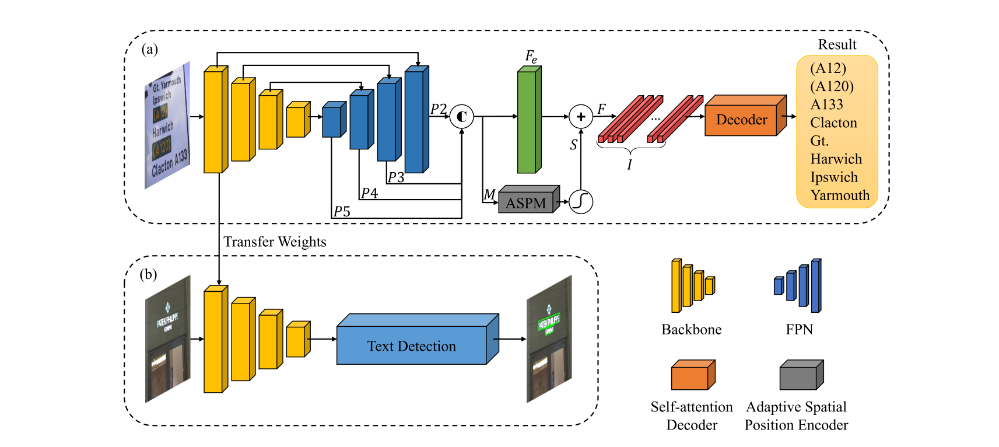

**STKM**: Self-attention based Text Knowledge Mining for Text Detection
===
This is the pytorch implementation of Paper: Self-attention based Text Knowledge Mining for Text Detection (CVPR 2021).



## Model
The pre-trained model is now available. 
- [Baidu Yun](https://pan.baidu.com/s/1jrifAigpmN1buYcvzGIowg) password: 5sea 
- [Google Driver](https://drive.google.com/file/d/1L_j_9rEoXVeSdGjQfBu1m0HMK_yEFj40/view?usp=sharing)

## Installation
- Python=3.8
- PyTorch=1.8.0, torchvision=0.9.0, cudatoolkit=10.2
- OpenCV for visualization

## Train
```
python train.py
```

## Test
```
python eval.py
```

## Transfer and replace
```
python trans2res.py
```

## Reference
If you find STKM useful in your research, please cite it in your publications:

```BibText
@inproceedings{wan2021self,
  title={Self-attention based text knowledge mining for text detection},
  author={Wan, Qi and Ji, Haoqin and Shen, Linlin},
  booktitle={Proceedings of the IEEE/CVF Conference on Computer Vision and Pattern Recognition},
  pages={5983--5992},
  year={2021}
}
```

